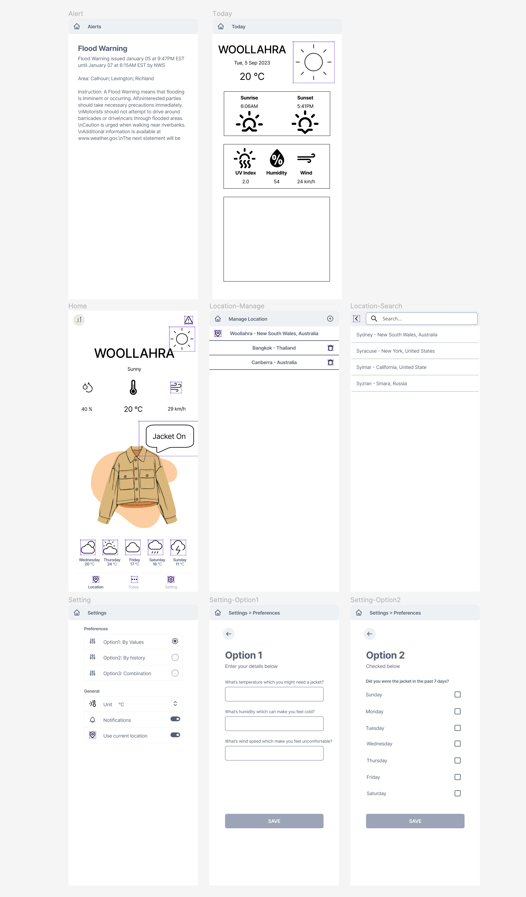
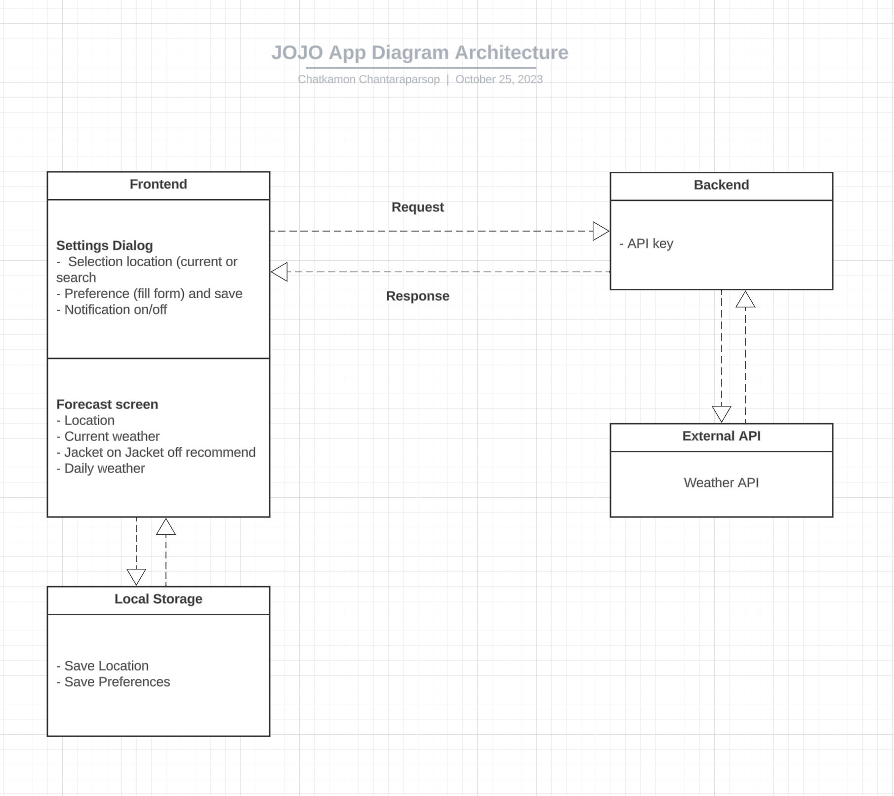

# JOJO-Jacket On Jacket Off

## Table of Contents

- [Overview](#overview)
- [Features](#features)
- [Technologies Used](#technologies-used)
- [Future Enhancements](#Future-Enhancements)
- [Activities](#activities)

## Overview

JOJO is designed to make the decision of wearing a jacket as easy as possible. It combines user preferences with real-time weather data to provide clear and instant recommendations - "Jacket ON" or "Jacket OFF."

## Features
- Retrieve current weather data for the user's location.
- Allow users to modify their preferences in setting.
- Options for preferences include temperature, humidity, wind speed values.
- Store user preferences locally.
- Compare weather data to user preferences and display "Jacket ON" or "Jacket OFF."

## Technologies Used
- Frontend Framework: React
- Backend Framework: TypeScript, Node.js, Express.js
- Weather API - for real-time weather updates, ensuring accurate recommendations.

## Future Enhancements

- Allow users to enter a location or use their current location to obtain weather data.
- Request location permissions if using the current location.
- Allow users to modify their location.
- Use web notifications API for push notifications.
- Provide user-friendly location and error messages.
- Display clear error messages if the weather API is unavailable.

## Activities

#### Research
- Competitive Analysis: Evaluate similar jacket weather apps, noting features and UI/UX.
- Market Research: Determine target users and the app's value proposition.
- Weather API Research: Evaluate options, costs, features, and reliability.
- Tech Stack Research: Determine the optimal tech stack within the engineer's skills.

#### Requirements Analysis & Documentation
- User Personas: Create user personas to understand the target audience better.
- Document Software Requirements: Outline the software requirements.
- Create Wireframes: Design initial wireframes to visualize the app's structure on Figma.

#### Design & Architecture
- High-Level System Architecture: Diagram the high-level system architecture.

- API Interface and Endpoints: Define the API interface and endpoints.
- Tech Stack Selection: Choose the tech stack, including React, Node.js etc.
- Modularization: Break down features into components for scalability.
- Infrastructure/Deployment Plan: Devise the infrastructure and deployment plan.

#### Development
- Version Control and Project Tracking: Set up version control (Git).
- Implement a project tracking/ticketing system: Trello.
- Development Environment Setup: Configure the development environment.
- API Integration: Implement APIs for weather data.
- Frontend Development: Build the application frontend and connect it to the API.
- User Input Forms: Create forms for user input.
